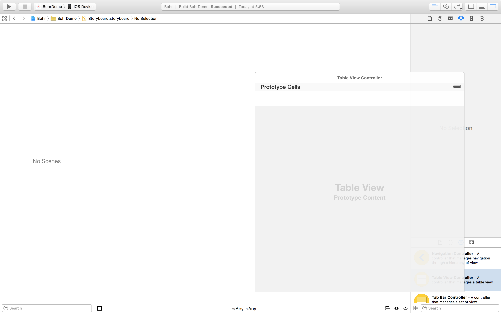
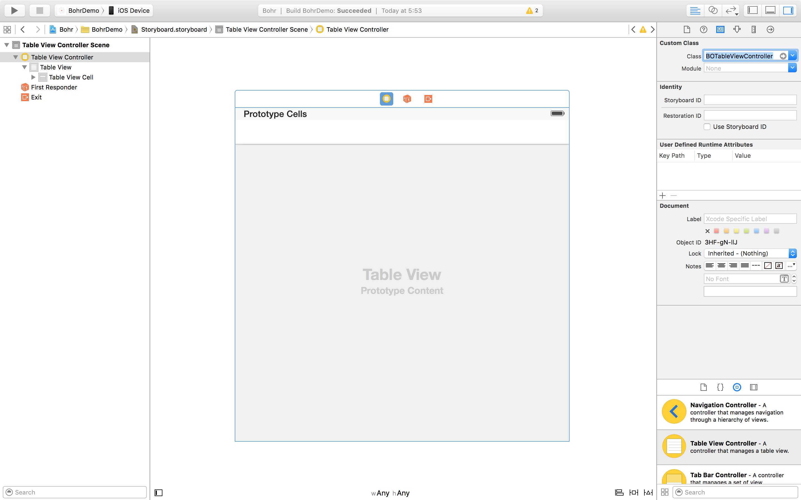
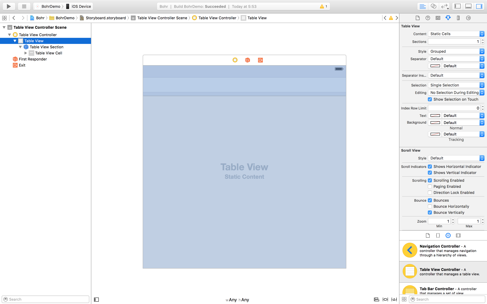
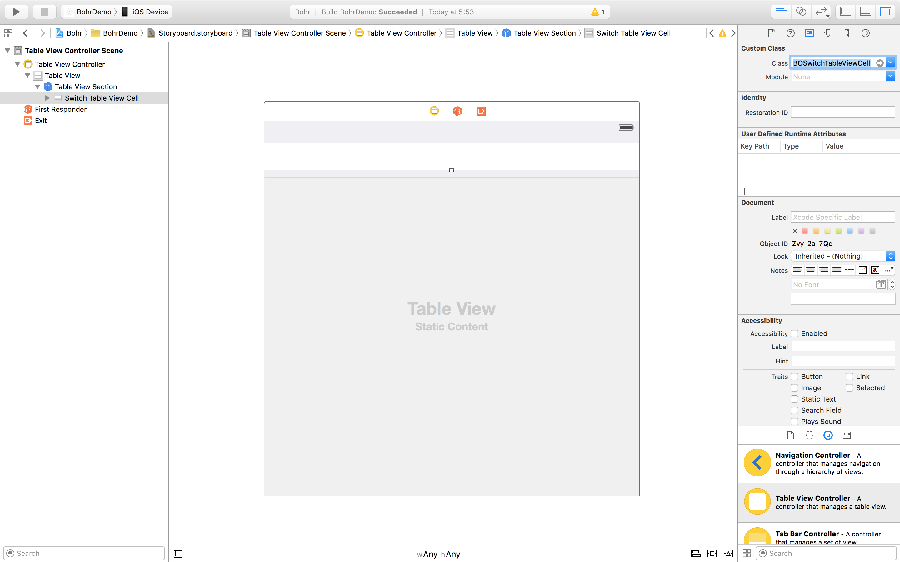
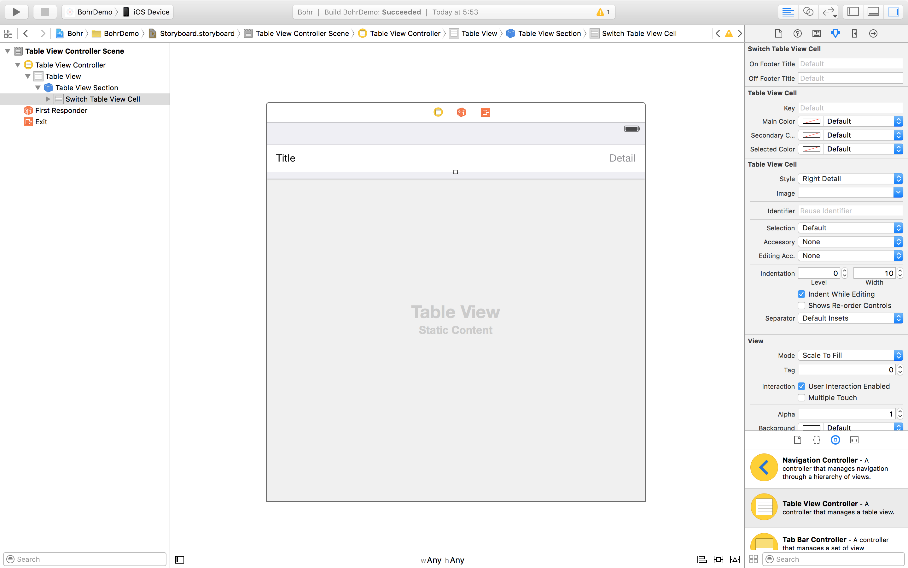
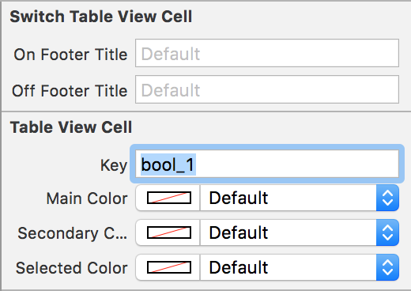

<p align="center">
	
</p>

Bohr allows you to set up a settings screen for your app with three principles in mind: ease, customization and extensibility.

<p align="center">
	
</p>

By default, Bohr supports multiple setting types such as strings, booleans or times. However, this framework has been built with extensibility in mind, meaning you can build your own custom classes to support any kind of setting type you want.

#### Why "Bohr"?

"Bohr" comes from Niels Bohr, conceiver of an atomic model which introduces the concept of electronic ___configuration___, a way to organize electrons by layers around the atom nucleus.

True story.

## Installation

#### Carthage

```
github "DavdRoman/Bohr"
```

#### CocoaPods

```ruby
pod 'Bohr'
```

#### Manual

Drag and copy all files in the [__Bohr__](Bohr) folder into your project.

## At a glance

#### Basic setup

The settings screen you're going to set up is represented by a `UITableViewController` subclass called `BOTableViewController`.

<p align="center">
	
</p>

Set the `UITableViewController` class to `BOTableViewController` or a subclass of it.

<p align="center">
	
</p>

Make sure to make the `UITableView` static and (optionally) grouped.

<p align="center">
	
</p>

Set each cell class to the desired `BOTableViewCell` subclass.

<p align="center">
	
</p>

Set each cell style to detail. Sometimes basic style is enough to make it work since not every cell needs a detail label, but in case of doubt detail style will work just fine.

<p align="center">
	
</p>

Finally, set the key of the cell to the desired value.

<p align="center">
	
</p>

#### Built-in BOTableViewCell's

As mentioned before, there's a bunch of built-in `BOTableViewCell` subclasses ready to be used:

- `BOSwitchTableViewCell`: manages `BOOL` values through a `UISwitch` control.
- `BOTextTableViewCell`: manages `NSString` values through a `UITextField` control.
- `BOTimeTableViewCell`: manages `NSInteger` values that represent a given time as the minute interval from midnight to such time. A revealing `UIPickerView` is used to set the time.
- `BOChoiceTableViewCell`: manages `NSInteger` values (which you can understand as "options" from a `NS_ENUM`) through taps on the cell itself.
- `BOOptionTableViewCell`: manages a single `NSInteger` value (which you can understand as an "option" from a `NS_ENUM`) depending on its position in its table view section. When selected, a checkmark appears on the right side.
- `BOButtonTableViewCell`: allows the user to perform an action when the cell is tapped.

#### Subclassing BOTableViewCell

Building a `BOTableViewCell` subclass is fairly straightforward.

First of all, the framework contains a header file called `BOTableViewCell+Subclass.h`. You must import that header in your subclass implementation file:

```obj-c
#import <Bohr/BOTableViewCell+Subclass.h>
```

That way you'll be able to access all the necessary methods for you to implement in your subclass:

- `setup`: used to set up the cell for the first time.
- `updateAppearance`: any code that defines the appearance of the cell should be put here. Note every `BOTableViewCell` instance contains 4 properties used to define its style:
	- `mainColor`: the color used for the title and other main elements of the cell.
	- `mainFont`: the font used for the title and other main elements of the cell.
	- `secondaryColor`: the color used for the detail text and other secondary elements of the cell.
	- `secondaryFont`: the font used for the detail text and other secondary elements of the cell.
- `expansionHeight`: the cell height will be expanded to the value returned by this method when tapped.
- `footerTitle`: the footer text to be displayed as a result of a setting value being modified.
- `wasSelectedFromViewController:`: called when the cell is tapped. The `BOTableViewController` where the cell is contained is passed.
- `settingValueDidChange`: called when the `NSUserDefault` value associated with the cell changes. You must represent such change through some visual element on your cell. Accessing that new value is as simple as calling `self.setting.value`.

Please take a look to the implementation of `BOSwitchTableViewCell` for a more detailed demonstration on how to subclass `BOTableViewCell`.

## License

Bohr is available under the MIT license.
