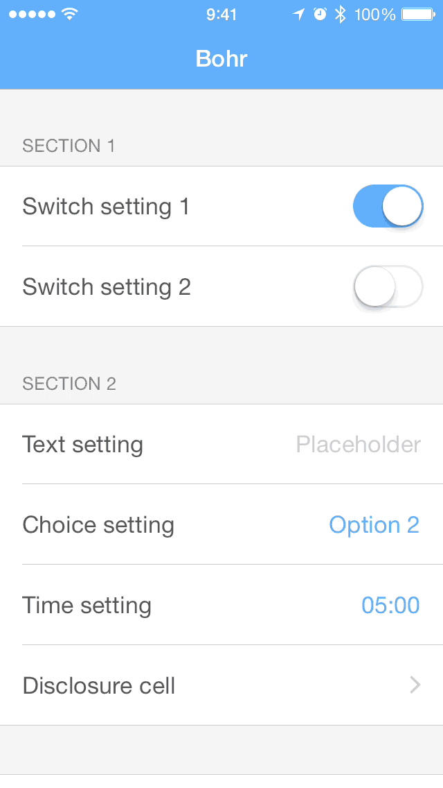

<p align="center">
	
</p>

Bohr allows you to set up a settings screen for your app with three principles in mind: ease, customization and extensibility.

<p align="center">
	
</p>

By default, Bohr supports multiple setting types such as strings, booleans or times. However, this framework has been built with extensibility in mind, meaning you can build your own custom classes to support any kind of setting type you want.

#### Why "Bohr"?

"Bohr" comes from Niels Bohr, conceiver of an atomic model which introduces the concept of electronic ___configuration___, a way to organize electrons by layers around the atom nucleus.

True story.

## Installation

#### Carthage

```
github "DavdRoman/Bohr"
```

#### CocoaPods

```ruby
pod 'Bohr'
```

#### Manual

Drag and copy all files in the [__Bohr__](Bohr) folder into your project.

## At a glance

#### Basic setup

The settings screen you're going to set up is represented by a `UITableViewController` subclass called `BOTableViewController`. Such controller manages `BOTableViewSection` instances, and each one of those manages a set of `BOTableViewCell` instances.

Here's an example of a really simple setup included in the demo project. Please check it out to see the full implementation. Please notice the code below belongs inside the `setup` method of a subclassed `BOTableViewController`.

```obj-c
- (void)setup {
	[self addSection:[BOTableViewSection sectionWithHeaderTitle:@"Section 1" handler:^(BOTableViewSection *section) {
		[section addCell:[BOSwitchTableViewCell cellWithTitle:@"Switch 1" key:@"bool_1" handler:nil]];
	}]];
}
```

#### Built-in BOTableViewCell's

There's a bunch of built-in `BOTableViewCell` subclasses ready to be used:

- `BOSwitchTableViewCell`: manages `BOOL` values through a `UISwitch` control.
- `BOTextTableViewCell`: manages `NSString` values through a `UITextField` control.
- `BONumberTableViewCell`: manages `NSNumber` values through a `UITextField` control.
- `BODateTableViewCell`: manages `NSDate` values representing a certain date. A revealing `UIDatePicker` is used to set the time.
- `BOTimeTableViewCell`: manages `NSDate` values representing a certain time. A revealing `UIDatePicker` is used to set the time.
- `BOChoiceTableViewCell`: manages `NSInteger` values (which you can understand as "options" from a `NS_ENUM`) through taps on the cell itself.
- `BOOptionTableViewCell`: manages a single `NSInteger` value (which you can understand as an "option" from a `NS_ENUM`) depending on its position in its table view section. When selected, a checkmark appears on the right side.
- `BOButtonTableViewCell`: allows the user to perform an action when the cell is tapped.

#### Subclassing BOTableViewCell

Building a `BOTableViewCell` subclass is fairly straightforward.

First of all, the framework contains a header file called `BOTableViewCell+Subclass.h`. You must import that header in your subclass implementation file:

```obj-c
#import <Bohr/BOTableViewCell+Subclass.h>
```

That way you'll be able to access all the possible elements for you to implement in your subclass.

Please take a look to some of the built-in cells for a more detailed demonstration on how to subclass `BOTableViewCell`.

## License

Bohr is available under the MIT license.
